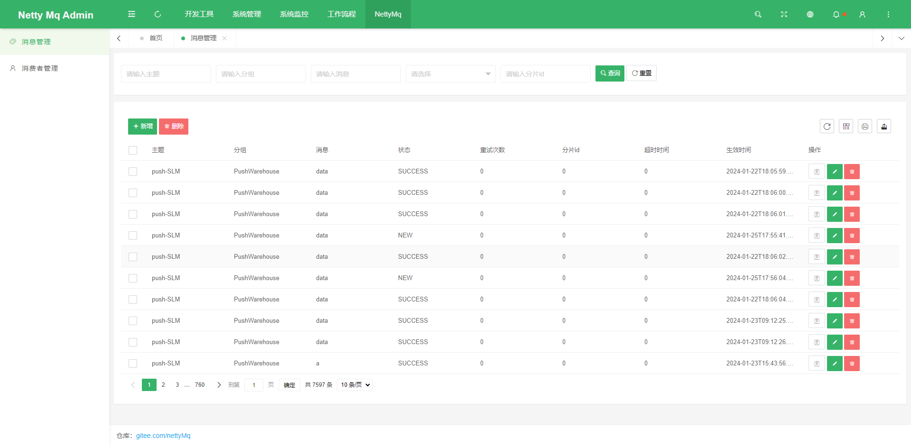
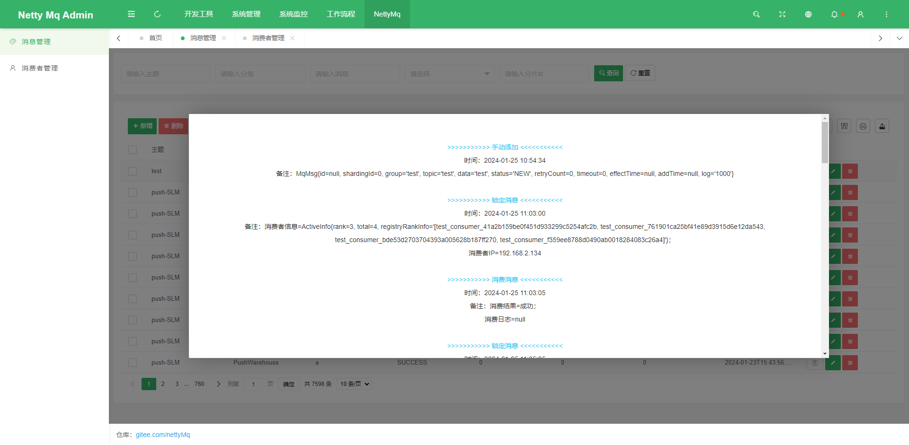
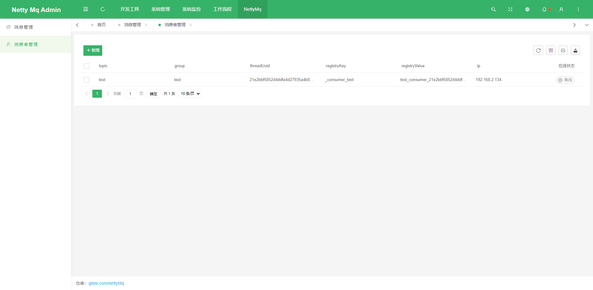
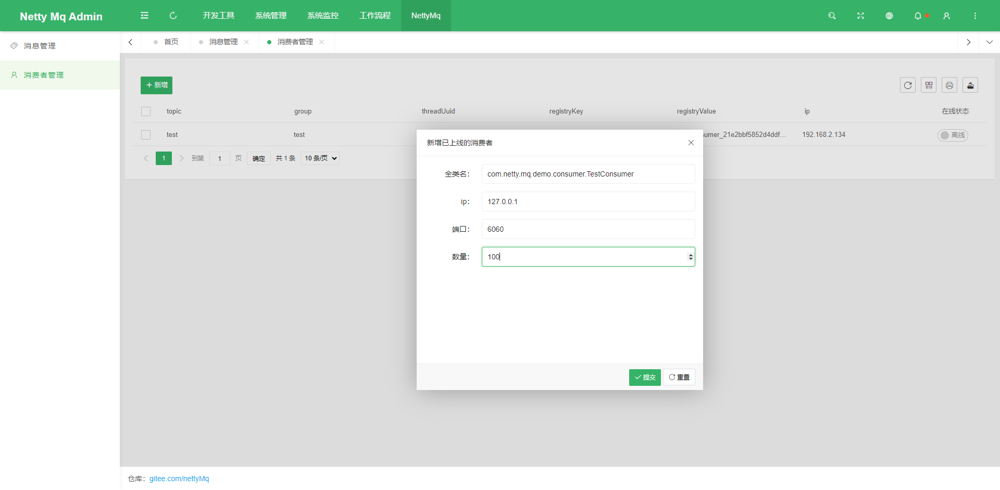
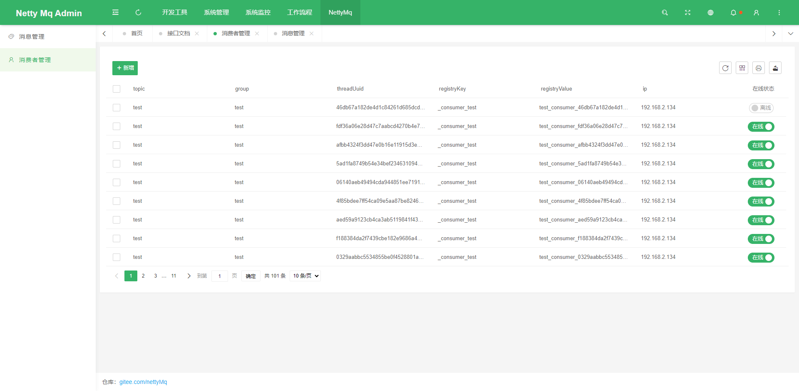

<div align="center">
<br/>

  <h1 align="center">
    NettyMq
  </h1>
  <h4 align="center">
    开 箱 即 用 的 消 息 队 列 管 理 中 心
  </h4> 


</div>

<p align="center">
    <a href="#">
        
    </a>
      <a href="#">
        
    </a>      
    <a href="#">
        
    </a>
</p>

<div align="center">
  
</div>


### 特色功能

1. 在线消费者展示
2. 在线增加消费者
3. 在线消费者启停

### 项目结构

```
netty-mq 
│
├─netty-mq-amdin 服务端
│  │
│  ├─src 
│  │  │
│  │  └─main 
│  │     │
│  │     ├─java 源码文件
│  │     │  │
│  │     │  ├─common 公共代码
│  │     │  │   
│  │     │  ├─modules 业务代码
│  │     │  │   
│  │     │  └─EntranceApplication 启动类
│  │     │   
│  │     └─resource 资源文件
│  │
│  └─pom.xml  Maven 配置
│  
│  
├─netty-mq-client 核心功能依赖包
│  │
│  ├─src 
│  │  │	
│  │  └─main 
│  │     │
│  │     └─java 源码文件
│  │        │
│  │        ├─broker 消息代理
│  │        │   
│  │        ├─consumer 消费者模块
│  │        │   
│  │        ├─factory spring初始化工厂
│  │        │   
│  │        ├─producer 消息生产中心
│  │        │   
│  │        ├─util 工具类
│  │        │   
│  │        └─MqMessage 消息实体类
│  │
│  └─pom.xml  Maven 配置
│         
├─netty-mq-demo 独立的服务端demo
│  │
│  ├─src 
│  │  │
│  │  └─main 
│  │     │
│  │     ├─java 源码文件
│  │     │  │
│  │     │  ├─config 系统配置
│  │     │  │   
│  │     │  ├─consumer 消费者业务代码
│  │     │  │
│  │     │  ├─controller 控制层
│  │     │  │
│  │     │  ├─util 工具类
│  │     │  │   
│  │     │  └─NettyMqDemoApplication 启动类
│  │     │   
│  │     └─resource 资源文件
│  │
│  └─pom.xml  Maven 配置
│  
└─pom.xml  Maven 配置

```

### 预览项目

| |  |
|-------------------|---------------------|
|  |   |
|  |   |
|  |   |


<p style="padding:10px;"  width="90%">


</p>


如果对您有帮助，您可以点右上角 💘Star💘 支持